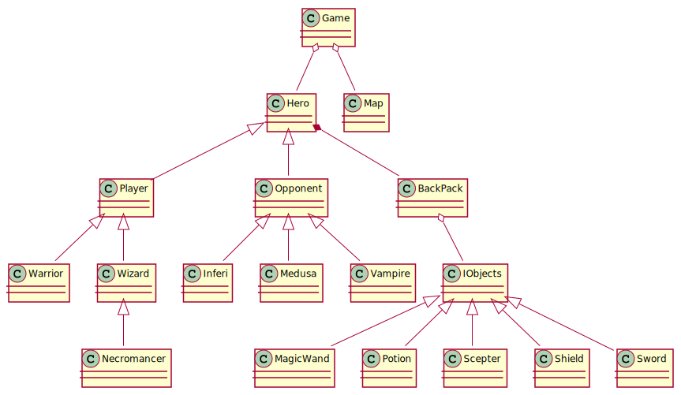
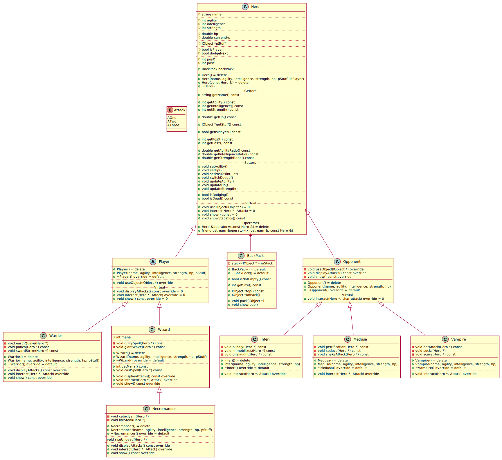
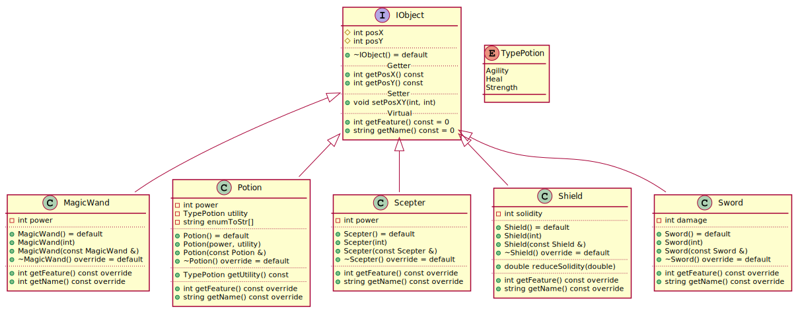
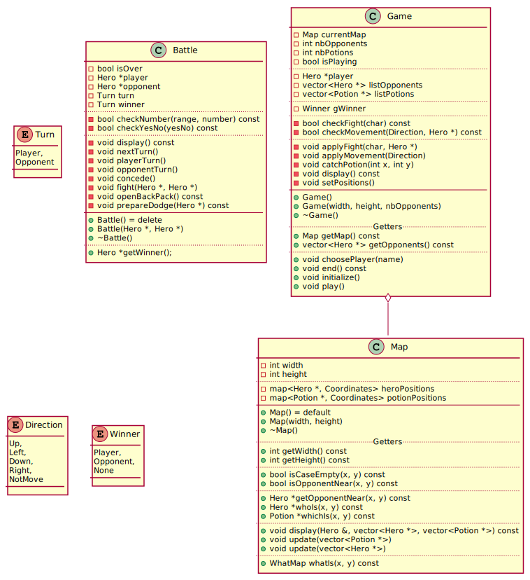

<br></br>
```
     __      __       .__
    /  \    /  \ ____ |  |   ____  ____   _____   ____
    \   \/\/   // __ \|  | _/ ___\/  _ \ /     \_/ __ \
     \        /\  ___/|  |_\  \__(  <_> )  Y Y  \  ___/
      \__/\  /  \___  >____/\___  >____/|__|_|  /\___  >
           \/       \/          \/            \/     \/
```
<br></br>
# Project Overview

This project was made as part of the C++ course, during the year 2020-2021 in the HE Arc.

We had to do a RPG, which means it's a Role Player Game. You will choose a Hero, who is gonna be moved in a virtual map, and you are able to choose his next direction. There is opponents, and when you are in front of them you have the choice to fight. You win the game when all opponents are defeated.

The opponents are moving automatically, and you can collect some potions in the map, which are going into your backpack. You can drink them later in a battle.

# Table of Contents

- [Project Overview](#project-overview)
- [Table of Contents](#table-of-contents)
- [Information](#information)
- [How To Play](#how-to-play)
    - [Prerequisite](#prerequisite)
    - [The Game](#the-game)
- [Structure of the Project](#structure-of-the-project)
- [UML Diagrams](#uml-diagrams)
    - [Global](#global)
    - [Actors](#actors)
    - [Objects](#objects)
    - [Game](#game)
- [Improvements](#improvements)
- [Contributor](#contributor)

# Information

In this version of the project, I choose to not use `mana` in `Wizard` and `Necromancer`, because I didn't know how to use it properly with the other classes.

# How To Play

## Prerequisite

To play this game you **<u>must</u>** execute `rpg.exe` file in a external shell, like `PowerShell` or `"CMD"`. The game doesn't work in native shell of Visual Studio Code.

## The Game

When you start the `rpg.exe` file, you'll have a welcome message, with a short description of the project. If you don't want to see the welcoming message, just type directly
> `.\rpg.exe --start`

Then the program will start, you'll enter your name, and the game start.

Each turn, a map is displayed in the shell, and you can choose the next direction of your player, by typing
- **`w `** for Up
- **`a `** for Left
- **`s `** for Down
- **`d `** for Right

When you're near an opponent, you have the choice to fight him or not. If you choose to fight, you'll have a menu with choices, for example you can choose between opening you backpack, fighting, preparing to dodge or conceding.

When you try to dodge, your chance is increased by 20% compared to usual. If you choose to fight, then you have the choice between 3 different attacks, with different damages.

The game is finished when you're dead, or if you win against all the opponents. Per default, the number of opponent is 3, but you can change in line number `34`, in the game's declaration.

# Structure of the Project

Here's some informations about how this project is structured.

- First, we have to main folder, RPG. It contains all the project. We have the file `main.cpp`, which contains the code and the verification for the guided beginning. My main file is `rpg.cpp`, it's the start of my game.
- Then we have the folder `apps`. It contains all the classes I needed, ordered by type, for example all my Heroes are in folder `actors`, and my objects are in `stuff`.
- We have to folder `bin`, which contains the final `rpg.exe` after the compilation is completed. In this folder we have the logs too, which repertories all the main actions of the game.
- And finally, we have the folder `settings`, which contains a unique file, `Settings.hpp`. This file is only settings for the smooth running of the game.

The tree looks like this :
```
RPG
├── apps
│   ├── actors
│   ├── enums
│   ├── game
│   ├── stuff
│   └── utils
├── bin
│   ├── logs
│   └── rpg.exe
├── settings
│   └── Settings.hpp
├── main.cpp
└── rpg.cpp
```

The logs, as I said before, are in the folder `bin/logs`. When we start a new game, and if the line number `30` in `rpg.cpp` isn't commented, then a new folder is automatically created, in the following format : First, we have the year, then the month, the day, `_` as separator, and finally the hour.

For example, if you launch the program the 7th of June, at 17:14:30, the folder name will be `20210607_171430`, and all the logs for this game will be in `bin/logs/20210607_171430`.

Then you have multiple files. One for the gam in general, one for the objects collected and used, and two new folders. The first one list a log file for all battles you made, and the second contains two files, the movements of the player, and the movements of the opponents.

# UML Diagrams

Here I will list all the diagrams of my project. One global, with all the main classes, and many others with classes described more specifically.

## Global

This diagram represents all the project, and how the different classes are linked.

We have on top of the tree the class `Game`, which is directly linked to the class `Hero` and `Map`. The map is alone by its side, but the heroes are separated in two other classes, the opponents and the player.

The hero possesses a backpack, which contains some objects, which are considered as `IObject`. Here, I choose to store only potions in the backpack, but in theory it can contains other stuffs, like a sword or a shield.



## Actors

Actors are all the classes for the heroes. You have in total 6 kind of heroes, but only 3 of them can be choose as player. The 3 others are the opponents.

For the player, we have
- The Warrior : A strongest hero, with a great strength, but stupid as a donkey
- The Wizard : A hero with a big intelligence, quite nimble, but not very strong
- The Necromancer : A powerful wizard, with powerful attacks. Unfortunately, its attacks made damage to him

The opponents can be
- An Inferi : It's a dead man controlled by black magic. He looks like the warrior ; strong but stupid
- A Vampire : I don't need to explain what's a vampire, he sucks you, and gains life
- A Medusa : The horrible monster of the mythology, she can petrifies you by his look



## Objects

Objects are there to give a plus to the game. They are mainly weapons, but some are potions. Weapons give a benefit to the player, and potions boost the statistics.

Among them we can find
- A magic wand, for the wizards
- Potions of Agility, Heal and Strength, to boost the hero's statistic
- A scepter, for the necromancers
- A shield, for the opponents, it's their object per default
- A sword, for the warriors

Potions can be found and collected by moving in the map, but weapons are fixed since the beginning for each type of heroes.



## Game

These classes concern all the game in general, with the game itself, and the map where the actors and objects are. There's also a class `Battle`, to handle all the fights between two actors.

Battle has only one public method, `Battle::getWinner()`, and all is handled by it.



# Improvements

Here I will list some ideas I would like to implement with more time.

1. A GUI for the game, with instants movements in reaction of directions
1. Play with 2 players
1. Let the player choose the game' settings
1. Using an API for getting real random names
1. Use mana for Wizard and Necromancer
1. Implements more attacks and actors

# Contributor

Author : [Vincent Jeannin](mailto:vincent.jeannin@he-arc.ch), ISC1c

&copy; 2021 All rights reserved, HE-Arc

