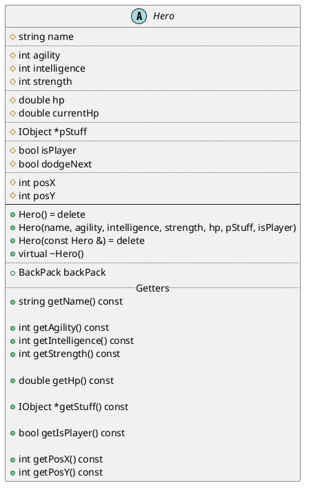

# CPP_FilRouge_ISC1c_Jeannin

Projet CPP RPG

## Diagram of Hero

```plantuml
@startuml
    abstract Hero
    {
        #string name
        ..
        #int agility
        #int intelligence
        #int strength
        ..
        #double hp
        #double currentHp
        ..
        #IObject *pStuff
        ..
        #bool isPlayer
        #bool dodgeNext
        ..
        #int posX
        #int posY
        --
        +Hero() = delete
        +Hero(name, agility, intelligence, strength, hp, pStuff, isPlayer)
        +Hero(const Hero &) = delete
        +virtual ~Hero()
        ..
        +BackPack backPack
        .. Getters ..
        +string getName() const

        +int getAgility() const
        +int getIntelligence() const
        +int getStrength() const

        +double getHp() const

        +IObject *getStuff() const

        +bool getIsPlayer() const

        +int getPosX() const
        +int getPosY() const
    }
@enduml
```