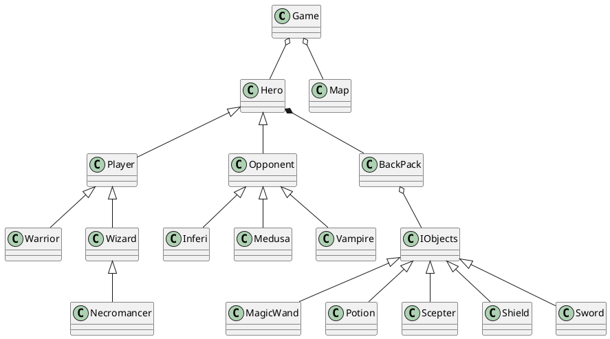

# Global

```plantuml
@startuml
    Game o-- Hero
    Game o-- Map
    Hero <|-- Player
    Hero <|-- Opponent
    Hero *-- BackPack
    BackPack o-- IObjects
    IObjects <|-- MagicWand
    IObjects <|-- Potion
    IObjects <|-- Scepter
    IObjects <|-- Shield
    IObjects <|-- Sword
    Player <|-- Warrior
    Player <|-- Wizard
    Wizard <|-- Necromancer
    Opponent <|-- Inferi
    Opponent <|-- Medusa
    Opponent <|-- Vampire
@enduml
```

# Actors

```plantuml
@startuml
    enum Attack
    {
        AOne,
        ATwo,
        AThree
    }

    abstract Hero
    {
        #string name
        ..
        #int agility
        #int intelligence
        #int strength
        ..
        #double hp
        #double currentHp
        ..
        #IObject *pStuff
        ..
        #bool isPlayer
        #bool dodgeNext
        ..
        #int posX
        #int posY
        ..
        +BackPack backPack
        --
        +Hero() = delete
        +Hero(name, agility, intelligence, strength, hp, pStuff, isPlayer)
        +Hero(const Hero &) = delete
        +{abstract} ~Hero()
        .. Getters ..
        +string getName() const

        +int getAgility() const
        +int getIntelligence() const
        +int getStrength() const

        +double getHp() const

        +IObject *getStuff() const

        +bool getIsPlayer() const

        +int getPosX() const
        +int getPosY() const

        +double getAgilityRatio() const
        +double getIntelligenceRatio() const
        +double getStrengthRatio() const
        .. Setters ..
        +void setAgility()
        +void setHp()
        +void setPosXY(int, int)
        +void switchDodge()
        +void updateAgility()
        +void updateHp()
        +void updateStrength()
        ..
        +bool isDodging()
        +bool isDead() const
        .. Virtual ..
        +{abstract} void useObject(IObject *) = 0
        +{abstract} void interact(Hero *, Attack) = 0
        +{abstract} void show() const = 0
        +{abstract} void showStatistics() const
        .. Operators ..
        +Hero &operator=(const Hero &) = delete
        +friend ostream &operator<<(ostream &, const Hero &)
    }
@enduml
@startuml
    abstract Player
    {
        +Player() = delete
        +Player(name, agility, intelligence, strength, hp, pStuff)
        +{abstract} ~Player() override = default
        ..
        +void useObject(IObject *) override
        .. Virtual ..
        +{abstract} void displayAttacks() const override = 0
        +{abstract} void interact(Hero *, Attack) override = 0
        +{abstract} void show() const override = 0
    }
@enduml
@startuml
    class Warrior
    {
        -void earthQuake(Hero *)
        -void punch(Hero *) const
        -void swordStrike(Hero *) const
        --
        +Warrior() = delete
        +Warrior(name, agility, intelligence, strength, hp, pStuff)
        +{abstract} ~Warrior() override = default
        ..
        +void displayAttacks() const override
        +void interact(Hero *, Attack) override
        +void show() const override
    }
@enduml
@startuml
    class Wizard
    {
        -int mana
        ..
        -void dizzySpell(Hero *) const
        -void giantWave(Hero *) const
        --
        +Wizard() = delete
        +Wizard(name, agility, intelligence, strength, hp, pStuff)
        +{abstract} ~Wizard() override = default
        ..
        +int getMana() const
        +void castSpell(Hero *) const
        ..
        +void displayAttacks() const override
        +void interact(Hero *, Attack) override
        +void show() const override
    }
@enduml
@startuml
    class Necromancer
    {
        -void cataclysm(Hero *)
        -void lifeSteal(Hero *)
        --
        +Necromancer() = delete
        +Necromancer(name, agility, intelligence, strength, hp, pStuff)
        +{abstract} ~Necromancer() override = default
        ..
        void riseUndead(Hero *)
        ..
        +void displayAttacks() const override
        +void interact(Hero *, Attack) override
        +void show() const override
    }
@enduml
@startuml
    class BackPack
    {
        -stack<IObject *> mStack
        --
        +BackPack() = default
        +{abstract} ~BackPack = default
        ..
        +bool isNotEmpty() const
        ..
        +int getSize() const
        ..
        +IObject *top() const
        +IObject *unPack()
        ..
        +void pack(IObject *)
        +void show(bool)
    }
@enduml
@startuml
    abstract Opponent
    {
        +Opponent() = delete
        +Opponent(name, agility, intelligence, strength, hp)
        +{abstract} ~Opponent() override = default
        ..
        -void useObject(IObject *) override
        -void displayAttacks() const override
        -void show() const override
        .. Virtual ..
        +{abstract} void interact(Hero *, char attack) override = 0
    }
@enduml
@startuml
    class Inferi
    {
        -void blindly(Hero *) const
        -void immobilizes(Hero *) const
        -void onslaught(Hero *) const
        --
        +Inferi() = delete
        +Inferi(name, agility, intelligence, strength, hp)
        +{abstract} ~Inferi() override = default
        ..
        +void interact(Hero *, Attack) override
    }
@enduml
@startuml
    class Medusa
    {
        -void petrification(Hero *) const
        -void seduce(Hero *) const
        -void snakeAttack(Hero *) const
        --
        +Medusa() = delete
        +Medusa(name, agility, intelligence, strength, hp)
        +{abstract} ~Medusa() override = default
        ..
        +void interact(Hero *, Attack) override
    }
@enduml
@startuml
    class Vampire
    {
        -void batAttack(Hero *) const
        -void sucks(Hero *)
        -void scare(Hero *) const
        --
        +Vampire() = delete
        +Vampire(name, agility, intelligence, strength, hp)
        +{abstract} ~Vampire() override = default
        ..
        +void interact(Hero *, Attack) override
    }
@enduml
@startuml
    Hero <|-- Player
    Hero <|-- Opponent
    Hero *-- BackPack

    Player <|-- Warrior
    Player <|-- Wizard
    Wizard <|-- Necromancer

    Opponent <|-- Inferi
    Opponent <|-- Medusa
    Opponent <|-- Vampire
@enduml
```

# IObject

```plantuml
@startuml
    interface IObject
    {
        #int posX
        #int posY
        ..
        +{abstract} ~IObject() = default
        .. Getter ..
        +int getPosX() const
        +int getPosY() const
        .. Setter ..
        +void setPosXY(int, int)
        .. Virtual ..
        +{abstract} int getFeature() const = 0
        +{abstract} string getName() const = 0
    }
@enduml
@startuml
    class MagicWand
    {
        -int power
        ..
        +MagicWand() = default
        +MagicWand(int)
        +MagicWand(const MagicWand &)
        +{abstract} ~MagicWand() = default
        ..
        +int getFeature() const override
        +int getName() const override
    }
@enduml
@startuml
    enum TypePotion
    {
        Agility
        Heal
        Strength
    }

    class Potion
    {
        -int power
        -TypePotion utility
        -string enumToStr[]
        ..
        +Potion() = default
        +Potion(power, utility)
        +Potion(const Potion &)
        +{abstract} ~Potion() override = default
        ..
        +TypePotion getUtility() const
        ..
        +int getFeature() const override
        +string getName() const override
    }
@enduml
@startuml
    class Scepter
    {
        -int power
        ..
        +Scepter() = default
        +Scepter(int)
        +Scepter(const Scepter &)
        +{abstract} ~Scepter() = default
        ..
        +int getFeature() const override
        +string getName() const override
    }
@enduml
@startuml
    class Shield
    {
        -int solidity
        ..
        +Shield() = default
        +Shield(int)
        +Shield(const Shield &)
        +{abstract} ~Shield() override = default
        ..
        +double reduceSolidity(double)
        ..
        +int getFeature() const override
        +string getName() const override
    }
@enduml
@startuml
    class Sword
    {
        -int damage
        ..
        +Sword() = default
        +Sword(int)
        +Sword(const Sword &)
        +{abstract} ~Sword() override = default
        ..
        +int getFeature() const override
        +string getName() const override
    }
@enduml
@startuml
    IObject <|-- MagicWand
    IObject <|-- Potion
    IObject <|-- Scepter
    IObject <|-- Shield
    IObject <|-- Sword
@enduml
```

# Game

```plantuml
@startuml
    enum Turn
    {
        Player,
        Opponent
    }

    class Battle
    {
        -isOver
        -Hero *player
        -Hero *opponent
        -Turn turn
        -Turn winner
        ..
        -bool checkNumber(range, number) const
        -bool checkYesNo(yesNo) const
        ..
        -void display() const
        -void nextTurn()
        -void playerTurn()
        -void opponentTurn()
        -void concede()
        -void fight(Hero *, Hero *)
        -void openBackPack() const
        -void prepareDodge(Hero *) const
        --
        +Battle() = delete
        +Battle(Hero *, Hero *)
        +{abstract} ~Battle()
        ..
        +Hero *getWinner();
    }
@enduml
@startuml
    enum Direction
    {
        Up,
        Left,
        Down,
        Right,
        NotMove
    }

    enum Winner
    {
        Player,
        Opponent,
        None
    }

    class Game
    {
        -Map currentMap
        -int nbOpponents
        -int nbPotions
        -bool isPlaying
        ..
        -Hero *player
        -vector<Hero *> listOpponents
        -vector<Potion *> listPotions
        ..
        -Winner gWinner
        ..
        -bool checkFight(char) const
        -bool checkMovement(Direction, Hero *) const
        ..
        -void applyFight(char, Hero *)
        -void applyMovement(Direction)
        -void catchPotion(int x, int y)
        -void display() const
        -void setPositions()
        --
        +Game()
        +Game(width, height, nbOpponents)
        +{abstract} ~Game()
        .. Getters ..
        +Map getMap() const
        +vector<Hero *> getOpponents() const
        ..
        +void choosePlayer(name)
        +void end() const
        +void initialize()
        +void play()
    }
@enduml
@startuml
    class Map
    {
        -int width
        -int height
        ..
        -map<Hero *, Coordinates> heroPositions
        -map<Potion *, Coordinates> potionPositions
        --
        +Map() = default
        +Map(width, height)
        +{abstract} ~Map()
        .. Getters ..
        +int getWidth() const
        +int getHeight() const
        ..
        +bool isCaseEmpty(x, y) const
        +bool isOpponentNear(x, y) const
        ..
        +Hero *getOpponentNear(x, y) const
        +Hero *whoIs(x, y) const
        +Potion *whichIs(x, y) const
        ..
        +void display(Hero &, vector<Hero *>, vector<Potion *>) const
        +void update(vector<Potion *>)
        +void update(vector<Hero *>)
        ..
        +WhatMap whatIs(x, y) const
    }
@enduml
@startuml
    Game o-- Map
@enduml
```