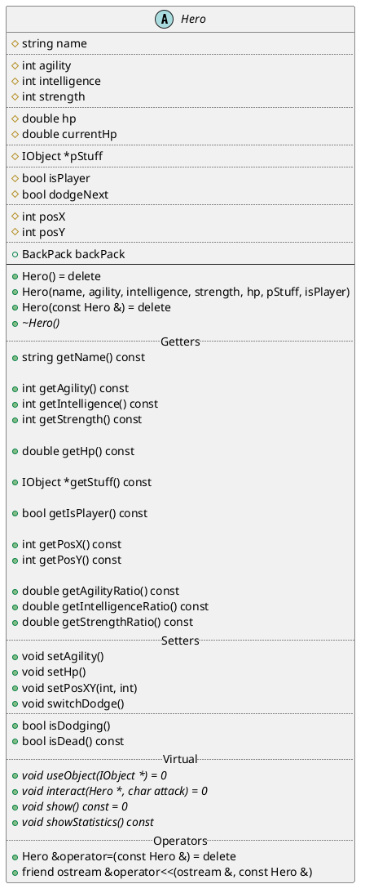

# Actors

```plantuml
@startuml
    abstract Hero
    {
        #string name
        ..
        #int agility
        #int intelligence
        #int strength
        ..
        #double hp
        #double currentHp
        ..
        #IObject *pStuff
        ..
        #bool isPlayer
        #bool dodgeNext
        ..
        #int posX
        #int posY
        ..
        +BackPack backPack
        --
        +Hero() = delete
        +Hero(name, agility, intelligence, strength, hp, pStuff, isPlayer)
        +Hero(const Hero &) = delete
        +{abstract} ~Hero()
        .. Getters ..
        +string getName() const

        +int getAgility() const
        +int getIntelligence() const
        +int getStrength() const

        +double getHp() const

        +IObject *getStuff() const

        +bool getIsPlayer() const

        +int getPosX() const
        +int getPosY() const

        +double getAgilityRatio() const
        +double getIntelligenceRatio() const
        +double getStrengthRatio() const
        .. Setters ..
        +void setAgility()
        +void setHp()
        +void setPosXY(int, int)
        +void switchDodge()
        ..
        +bool isDodging()
        +bool isDead() const
        .. Virtual ..
        +{abstract} void useObject(IObject *) = 0
        +{abstract} void interact(Hero *, char attack) = 0
        +{abstract} void show() const = 0
        +{abstract} void showStatistics() const
        .. Operators ..
        +Hero &operator=(const Hero &) = delete
        +friend ostream &operator<<(ostream &, const Hero &)
    }
@enduml
@startuml
    abstract Player
    {
        +Player() = delete
        +Player(name, agility, intelligence, strength, hp, pStuff)
        +{abstract} ~Player() override = default
        ..
        +void useObject(IObject *) override
        .. Virtual ..
        +{abstract} void displayAttacks() const override = 0
        +{abstract} void interact(Hero *, char attack) override = 0
        +{abstract} void show() const override = 0
    }
@enduml
@startuml
    class BackPack
    {
        -stack<IObject *> mStack
        --
        +BackPack() = default
        +{abstract} ~BackPack = default
        ..
        +bool isNotEmpty() const
        ..
        +int getSize() const
        ..
        +IObject *top() const
        +IObject *unPack()
        ..
        +void pack(IObject *)
        +void show(bool)
    }
@enduml
@startuml
    abstract Opponent
    {
        +Opponent() = delete
        +Opponent(name, agility, intelligence, strength, hp)
        +{abstract} ~Opponent() override = default
        ..
        -void useObject(IObject *) override
        -void displayAttacks() const override
        -void show() const override
        .. Virtual ..
        +{abstract} void interact(Hero *, char attack) override = 0
    }
@enduml
@startuml
    Hero <|-- Player
    Hero <|-- Opponent
    Hero *-- BackPack

    Player <|-- Warrior
    Player <|-- Wizard
    Wizard <|-- Necromancer

    Opponent <|-- Inferi
    Opponent <|-- Medusa
    Opponent <|-- Vampire
@enduml
```

# IObject

```plantuml
@startuml
    interface IObject
    {
        #int posX
        #int posY
        ..
        +{abstract} ~IObject() = default
        .. Getter ..
        +int getPosX() const
        +int getPosY() const
        .. Setter ..
        +void setPosXY(int, int)
        .. Virtual ..
        +{abstract} int getFeature() const = 0
        +{abstract} string getName() const = 0
    }
@enduml
@startuml
    class MagicWand
    {
        -int power
        ..
        +MagicWand() = default
        +MagicWand(int)
        +MagicWand(const MagicWand &)
        +{abstract} ~MagicWand() = default
        ..
        +int getFeature() const override
        +int getName() const override
    }
@enduml
@startuml
    enum TypePotion
    {
        Agility
        Heal
        Strength
    }

    class Potion
    {
        -int power
        -TypePotion utility
        -string enumToStr[]
        ..
        +Potion() = default
        +Potion(power, utility)
        +Potion(const Potion &)
        +{abstract} ~Potion() override = default
        ..
        +TypePotion getUtility() const
        ..
        +int getFeature() const override
        +string getName() const override
    }
@enduml
@startuml
    class Scepter
    {
        -int power
        ..
        +Scepter() = default
        +Scepter(int)
        +Scepter(const Scepter &)
        +{abstract} ~Scepter() = default
        ..
        +int getFeature() const override
        +string getName() const override
    }
@enduml
@startuml
    class Shield
    {
        -int solidity
        ..
        +Shield() = default
        +Shield(int)
        +Shield(const Shield &)
        +{abstract} ~Shield() override = default
        ..
        +double reduceSolidity(double)
        ..
        +int getFeature() const override
        +string getName() const override
    }
@enduml
@startuml
    class Sword
    {
        -int damage
        ..
        +Sword() = default
        +Sword(int)
        +Sword(const Sword &)
        +{abstract} ~Sword() override = default
        ..
        +int getFeature() const override
        +string getName() const override
    }
@enduml
@startuml
    IObject <|-- MagicWand
    IObject <|-- Potion
    IObject <|-- Scepter
    IObject <|-- Shield
    IObject <|-- Sword
@enduml
```

# Game

```plantuml
@startuml
    class Battle
    {

    }
@enduml
@startuml
    class Game
    {

    }
@enduml
@startuml
    class Map
    {

    }
@enduml
```